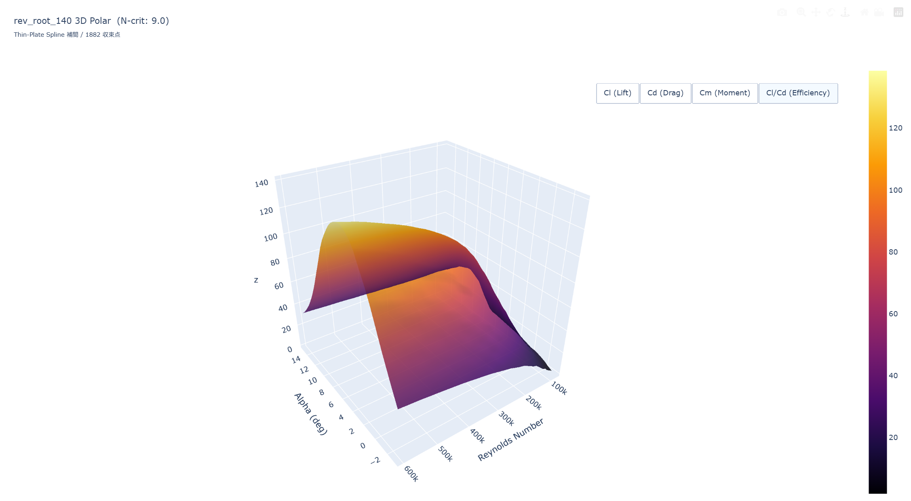

# xfoil-3d

XFOILを用いて翼型の3次元極曲線を計算・可視化するCLIツール。  
複数のレイノルズ数に対して並列計算を行い、Thin-Plate Spline (RBF) 補間によって滑らかな3Dサーフェスを生成。

## 必要環境

| ツール | バージョン |
|--------||
| Python | 3.9 以上 |
| XFOIL  | 6.99（`xfoil.exe` をプロジェクト直下に配置） |